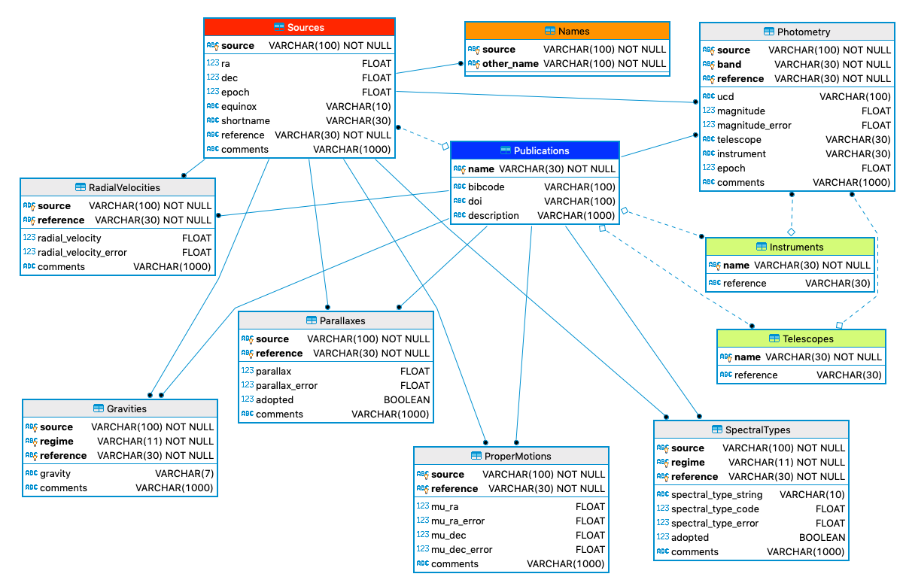

# SIMPLE

The vision of the SIMPLE project is to create a *collaborative* database of low-mass stars, brown dwarfs, and directly 
imaged exoplanets: a simple archive of complex objects. The tables and fields currently included in the 
database are described in the [Documentation](https://github.com/SIMPLE-AstroDB/SIMPLE-db/blob/main/documentation/README.md) 
and currently include names, coordinates, photometry and reference and data provenance information and is visualized 
in the [schema](https://github.com/SIMPLE-AstroDB/SIMPLE-db#database-schema) below. 
We are currently working on including kinematics, spectra, images, and modeled and retrieved parameters. 

We are developing several different methods to interact with the database, including python, a website and API, and 
database browsers.

While we are using brown dwarfs to build out the SIMPLE database, our intention is to build a database schema and 
software which could be used by other subfields to roll their own collaborative databases and web interfaces.

This database uses the [SQLAlchemy ORM](https://docs.sqlalchemy.org/en/14/orm/index.html) and is designed to be
interacted with via the `astrodbkit2` package.

If you'd like to participate or just stay in the loop as this project progresses, please request to join this discussion
 list:
https://groups.google.com/forum/#!forum/simple-archive

To see more details about what we've discussed so far, check out the running notes on the project: 
https://docs.google.com/document/d/1zDayF4ERMjj22QI3RaUZeTeb6nIVl3c2KDNw5WLLUqE/edit

## Getting Started

If you'd like to set up your own copy of the SIMPLE database, here's what we recommend:

1. Clone or download a copy of this repo somewhere locally

2. Set up an environment for the python code. 
A conda environment file exists for convenience. The following commands will create and activate an environment called `simple-db`:

    ```bash
    conda env create -f environment2.yml
    conda activate simple-db
    ```
    <!--- 
    # 3. Install the AstrodbKit2 package:
    #
    # ```bash
    # pip install git+https://github.com/dr-rodriguez/AstrodbKit2
    # ```
    
    # 5. Create the database from the data. If you already have a database (eg, a binary db file with SQLite), **skip to the next step**. 
    #
    # ```python
    # from astrodbkit2.astrodb import create_database
    # from simple.schema import * # Sets up the SIMPLE database schema
    
    # connection_string = 'sqlite:///SIMPLE.db'  # Assumes SQLite connection to database in local folder
    # create_database(connection_string)
    # ```
    --->

3. Connect to the database file `SIMPLE.db` as a Database object called `db`

    ```python
    from astrodbkit2.astrodb import Database
    
    connection_string = 'sqlite:///SIMPLE.db'  # Assumes SQLite connection to database in local folder
    db = Database(connection_string)
    ```

4. Use `astrodbkit2` to [explore](https://astrodbkit2.readthedocs.io/en/latest/#exploring-the-schema), [query](https://astrodbkit2.readthedocs.io/en/latest/#querying-the-database), and/or [modify](https://astrodbkit2.readthedocs.io/en/latest/#modifying-data) the database.
For example:
    - Find all objects in the database with "0141" in the name
        ```
        db.search_object('0141', fmt='astropy')
        ```
    
    - See all the data in the database for 2MASS J01415823-4633574

        ```
        db.inventory('2MASS J01415823-4633574', pretty_print=True)
        ```


<!---
4. Load database contents from source, if needed. 
This will ensure you are working with the latest version.

    ```python
    db.load_database('data')
    ```
7. Commit any changes back to source, if needed.
This changes can then be submitted via pull request to the repo.

    ```python
    db.save_database('data')
    ```
    
 --->
    
## SIMPLE Database Schema

The schema for the SIMPLE database can be found in `simple/schema.py`.

A graphical representation of the SIMPLE schema:

