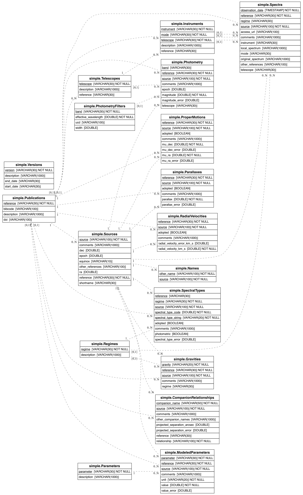

# Schema Documentation
This documentation is generated from the simple/schema.yaml file.

## Tables
- [Publications](schema/Publications.md)
- [Telescopes](schema/Telescopes.md)
- [Instruments](schema/Instruments.md)
- [Parameters](schema/Parameters.md)
- [PhotometryFilters](schema/PhotometryFilters.md)
- [Versions](schema/Versions.md)
- [Regimes](schema/Regimes.md)
- [Sources](schema/Sources.md)
- [Names](schema/Names.md)
- [Photometry](schema/Photometry.md)
- [Parallaxes](schema/Parallaxes.md)
- [ProperMotions](schema/ProperMotions.md)
- [RadialVelocities](schema/RadialVelocities.md)
- [SpectralTypes](schema/SpectralTypes.md)
- [Gravities](schema/Gravities.md)
- [Spectra](schema/Spectra.md)
- [ModeledParameters](schema/ModeledParameters.md)
- [CompanionRelationships](schema/CompanionRelationships.md)

## Schema Diagram

